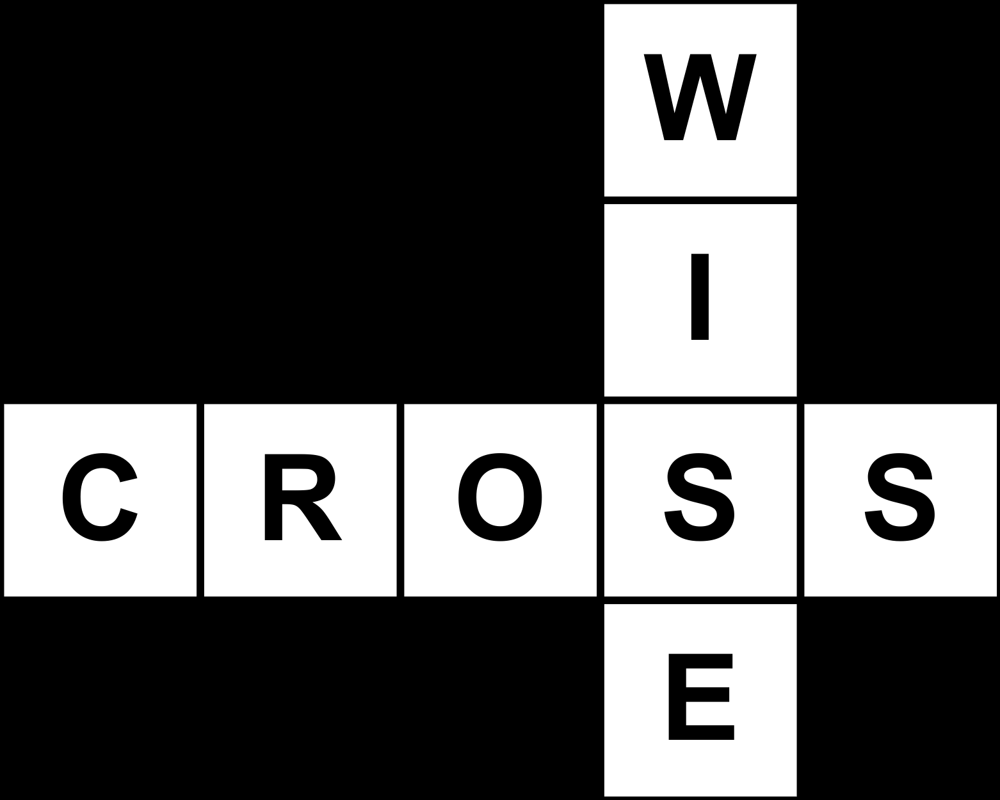
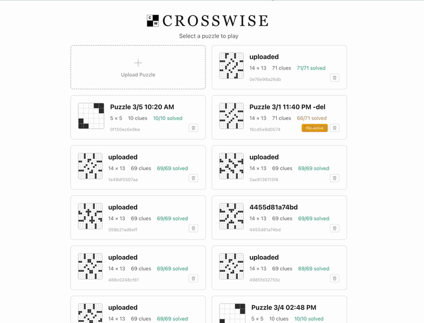

# Crosswise

<p align="center">
  
</p>


[](LICENSE)

Crosswise is a high-precision crossword digitizer and autonomous solver. Printed newspaper crosswords are difficult to digitize reliably due to grid distortion, OCR errors, and ambiguous clues. Crosswise solves this by combining computer vision, structured verification, and multi-stage AI reasoning into a robust pipeline — **98.5% accuracy across 39 real printed newspaper puzzles**, at ~$1.50 per solve.

<p align="center">
  
  <br>
  <em>Upload a photo → grid detected → clues extracted via OCR → AI solves in real-time → play with hints</em>
</p>

## How it works

1. **Upload** a photo of a printed crossword
2. **Grid detection** — OpenCV finds the grid, corrects perspective, and computes clue numbers algorithmically from the grid geometry (no need to OCR tiny numbers inside grid)
3. **OCR** — Gemini 3 Flash extracts clues directly from the raw photo, no preprocessing needed
4. **Verification** — every OCR clue must match a grid slot and vice versa (100% correspondence required before solving)
5. **Solve** — Multi-stage AI solver: database lookup (10.1M clue pairs), web search for pop culture, Claude Opus iterative solving with constraint propagation, and automatic conflict backtracking when crossing patterns reveal wrong answers.
6. **Play** — interactive player with Check/Reveal functionality, timer, and hints + explanations to facilitate learning.

## Key numbers

Tested on **39 real newspaper photographs** (14x13, 15x15, and 21x21 grids):

- **2,846 / 2,888 clues solved** (98.5%) — 32 perfect solves, 7 near-perfect (86–99%), zero failures
- **~$1.50 per puzzle** in API costs (see breakdown below)
- **78% of clues** resolved instantly via database lookup — the LLM only handles the remaining 22%
- **Self-correcting**: conflict backtracking detected and fixed wrong answers in 38% of puzzles
- **10.1M** historical clue/answer pairs + **605K** unique words for pattern matching (see [DATASETS.md](docs/DATASETS.md))
- **97 tests** (91 unit, 6 integration) with pytest, run via GitHub Actions CI on every push

### Cost breakdown (average per puzzle)

| Phase | Model | Avg Cost |
|-------|-------|----------|
| Web pre-pass | Claude Haiku + web search | $0.48 |
| Candidate generation | Claude Opus/Sonnet | $0.37 |
| Iterative solving | Claude Opus | $0.58 |
| Hint generation | Claude Haiku | $0.07 |
| **Total** | | **$1.50** |

## Demo

A pre-solved sample puzzle is included so you can try the interactive player without API keys or the clue database. *The sample puzzle is a homemade digital grid — real newspaper puzzles are not included due to copyright.*

```bash
git clone https://github.com/jnmathew/crosswise.git
cd crosswise
make install
make run-demo
# Open http://localhost:5173
```

## Getting started

### Prerequisites

- Python 3.11+
- [uv](https://docs.astral.sh/uv/) (`curl -LsSf https://astral.sh/uv/install.sh | sh`)
- Node.js 20+
- API keys: [Anthropic](https://console.anthropic.com/) (required), [Google Gemini](https://aistudio.google.com/apikey) (required)

### Setup

```bash
git clone https://github.com/jnmathew/crosswise.git
cd crosswise
make install

# Set ANTHROPIC_API_KEY and GEMINI_API_KEY
cp .env.example .env

# Download clue database (~1.5GB peak, ~1GB after cleanup)
make setup
```

### Run

```bash
make run
# Backend: http://localhost:8000
# Frontend: http://localhost:5173
# API docs: http://localhost:8000/docs
```

## Solve pipeline

The solver uses a tiered strategy that minimizes API cost while maintaining accuracy:

```
Photo → Grid Detection (OpenCV) → Clue Extraction (Gemini OCR) → Verification
  → Candidate Generation → Iterative Solver (Claude) → CSP Cleanup → Playable Puzzle
```

1. **Database lookup** — instant SQLite query resolves ~78% of clues from 10.1M historical pairs
2. **Web pre-pass** — Haiku web search identifies pop culture, celebrity, and current-event clues
3. **Candidate generation** — parallel Claude Opus + Sonnet calls generate candidates for remaining clues
4. **Bouncer scoring** — cross-references all candidates against the database and word index (0.3-1.0 confidence)
5. **LLM iterative solving** — 6 Opus passes: commit high-confidence answers, propagate crossing letters, re-solve
6. **Constraint propagation** — auto-commits clues where crossing patterns eliminate all but one candidate (zero API cost)
7. **Conflict resolution** — detects dead-end patterns, traces blame to wrong committed answers, re-solves clusters with web search
8. **CSP cleanup** — constraint satisfaction solver (MAC + MRV + backjumping) handles any remaining clues
9. **Hint generation** — parallel Claude calls produce one hint and one explanation per solved clue

## Architecture

```
crosswise/
  vision/           OpenCV grid detection, image preprocessing, clue extraction
  ocr/              Pluggable OCR provider (Gemini 3 Flash)
  solver/           LLM iterative solver, CSP, cost tracking, hint generation
  solver/candidates/ Database lookup, Claude generation, web pre-pass, scoring
  api/              FastAPI backend, SSE progress streaming, session management
web/                React + TypeScript + Vite interactive player
```

**Where to start reading**: `crosswise/api/server.py` (15 endpoints) delegates to `crosswise/api/pipeline.py` (orchestration), which calls into `crosswise/vision/` (image processing) and `crosswise/solver/` (solving).

## Tech stack

**Backend**: Python 3.11, FastAPI, OpenCV, Gemini 3 Flash, Claude Opus/Sonnet/Haiku, SQLite

**Frontend**: React 18, TypeScript, Vite, react-crossword, Server-Sent Events

## Environment variables

| Variable | Required | Purpose |
|----------|----------|---------|
| `GEMINI_API_KEY` | Yes | Gemini 3 Flash OCR |
| `ANTHROPIC_API_KEY` | Yes | Claude candidate generation, solving, and hints |

## Data sources

The clue database combines ~9-11M deduplicated pairs from 4 sources (xd archive, CrosswordQA, Crossword Nexus, Peter Broda). See [DATASETS.md](docs/DATASETS.md) for licensing, URLs, and details. Run `make setup` to download everything.
